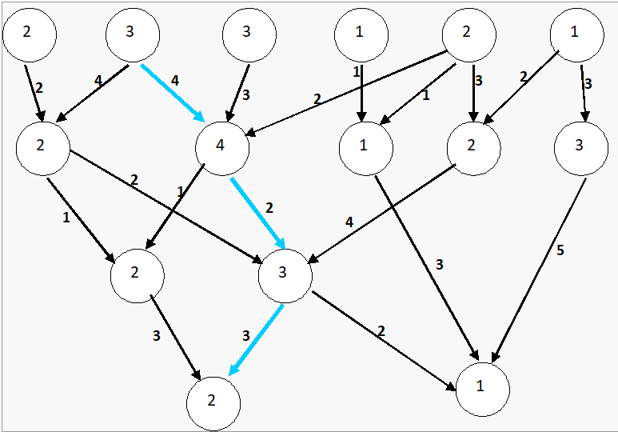
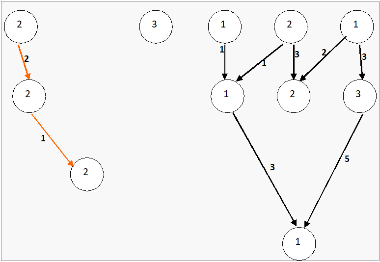
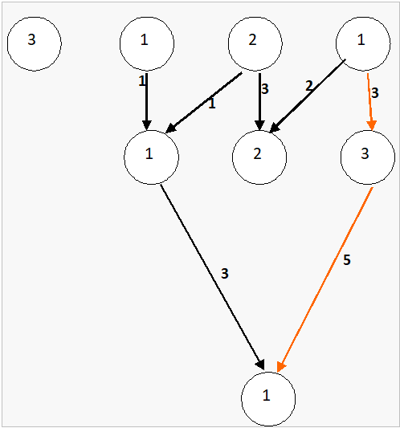
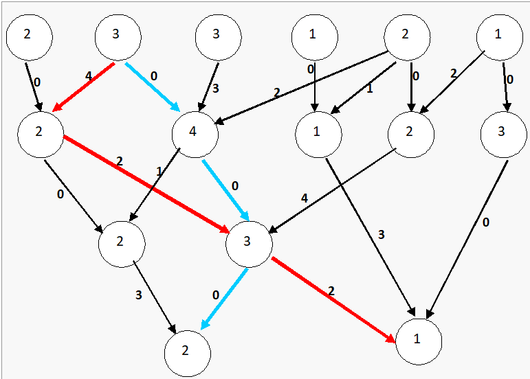
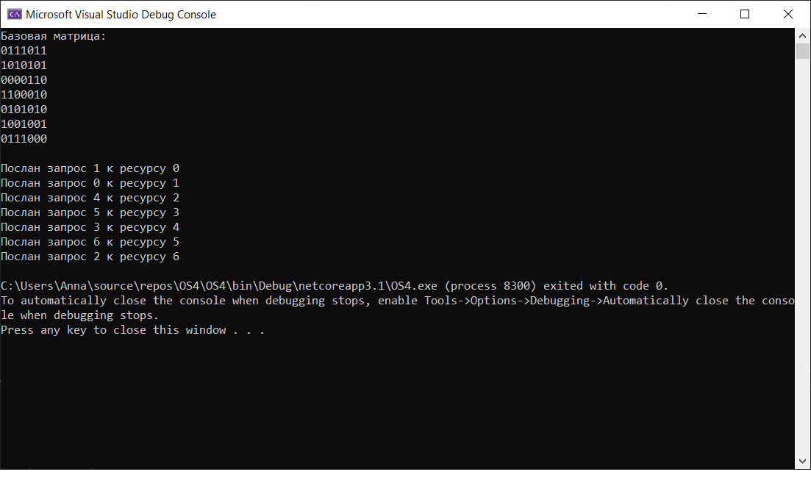

# Lab4OS
## Дослідження принципів проектування та роботи динамічного та статичного планування
Варіант - 12.  Найти зону пошуку для графа перестановки(кількість вершин не менше 30).
При статичному плануванні вирішуються дві основні задачі: 
1.	Пошук мінімальної кількості процесорів, необхідних для вирішення комплексу ін-формаційно і по управлінню взаємозв'язаних завдань за час, заданий, що не перевищує, або критичний.
2.	Пошук плану вирішення заданого комплексу інформаційно і по управлінню  взає-мозв'язаних завдань на заданій кількості процесорів за мінімальний час.

Граф перестановки - це граф, вершини якого відповідають елементам перестановки, а ребра представляють пари елементів, дотримання яких стало зворотним після перестановки. Графи перестановки можна визначити геометрично як графи перетинів відрізків, кінці яких лежать на двох паралельних прямих. Різні перестановки можуть дати один і той же граф перестановки.

Знаходження зони пошуку оптимального пошуку рішення по заданому графу:

Операція «занулення»:

                ||

Приміняємо алгоритм "занулення":

У результаті одержуємо:

Алгоритм :

1.	Створюємо базову матрицю суміжності. Занулюємо  головний критичний шлях.
2. Шукаємо наступний критичний шлях, в частині графа, що залишилася, якщо їх 2 чи більше, то вибираємо перший.
Виконуємо такі дії: 
а) Спочатку ми знаходимо мінімальний рядок в нашій матриці, починаючи з i-рядка. 
б) Змінюємо мінімальний рядок в нашій базовій матриці та матриці рішення на знайддений рядок.
в) Аналогічно виконуємо дії для стовпців матриці 
г) Комбінація mass[i], solutions[i] буде оптимальною зоною пошуку у графі.
4.	Операції пошуку і занулення продовжуємо до тих пір, поки не занулюватиме останній критичний шлях.

Результати роботи програми:

 
  
 
 
  
  
 

